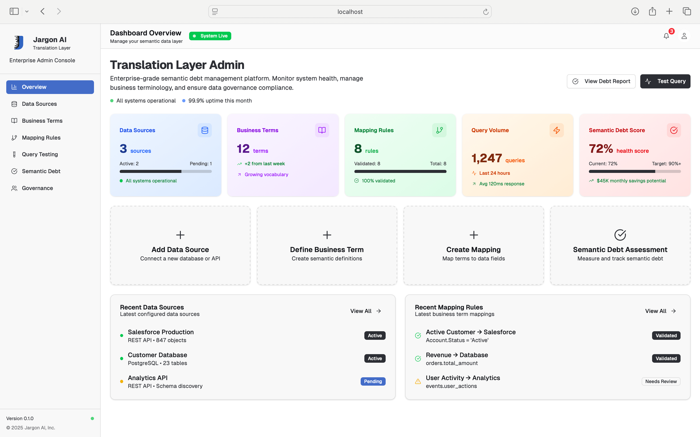
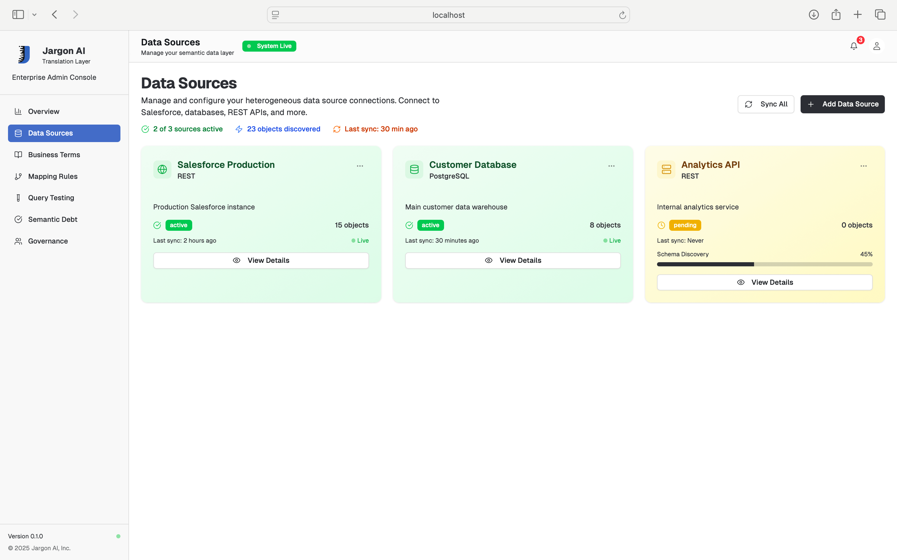
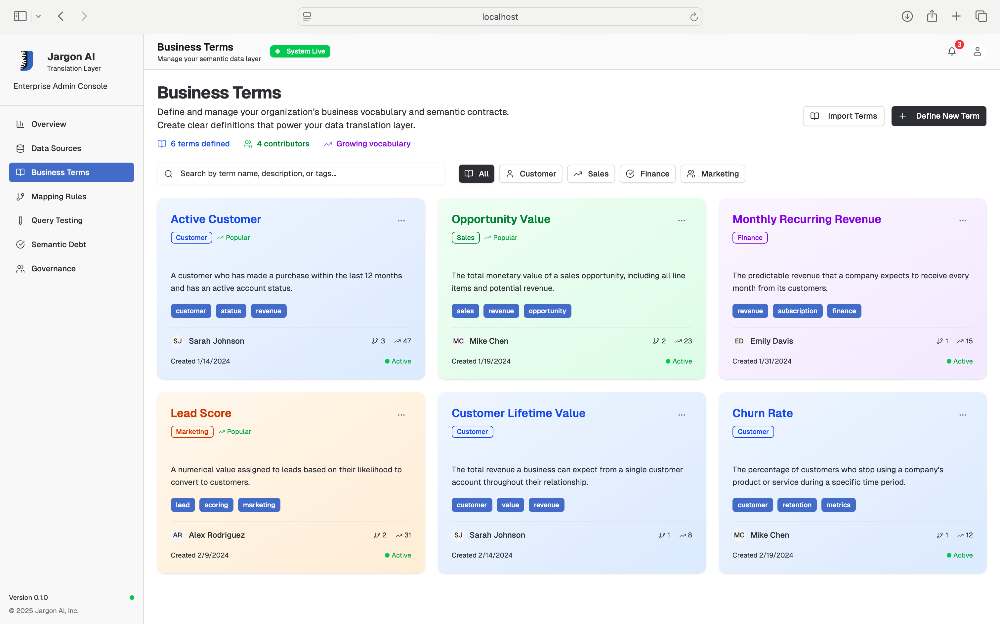
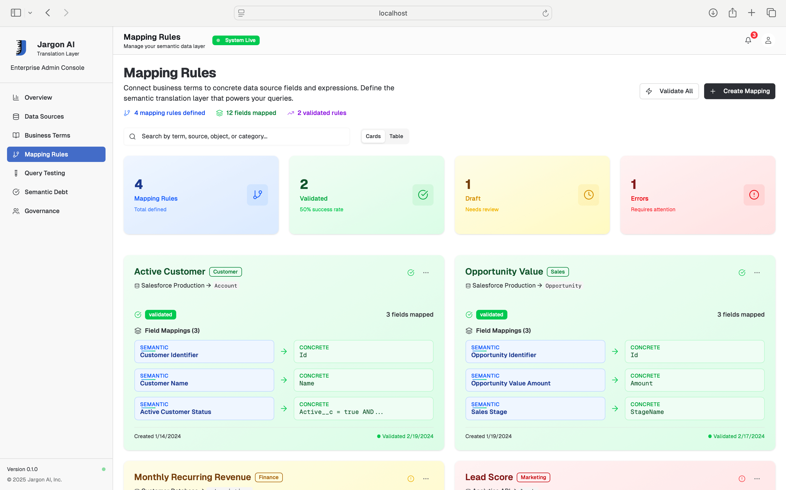
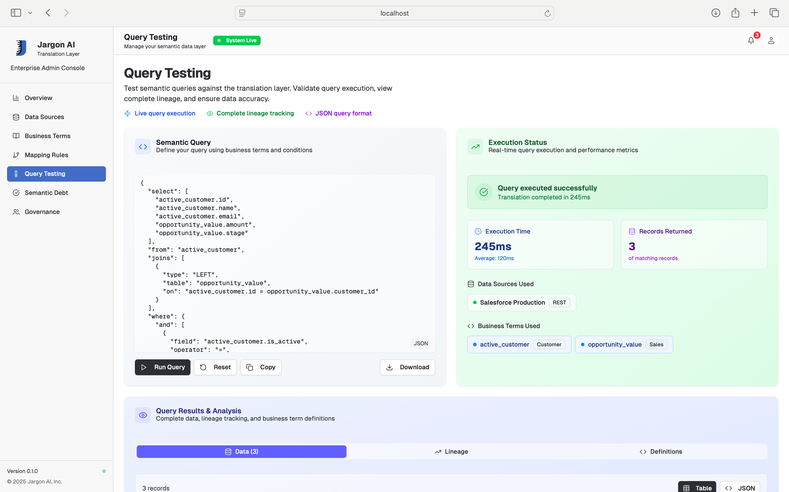
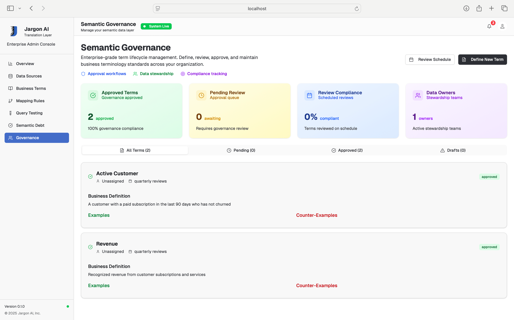
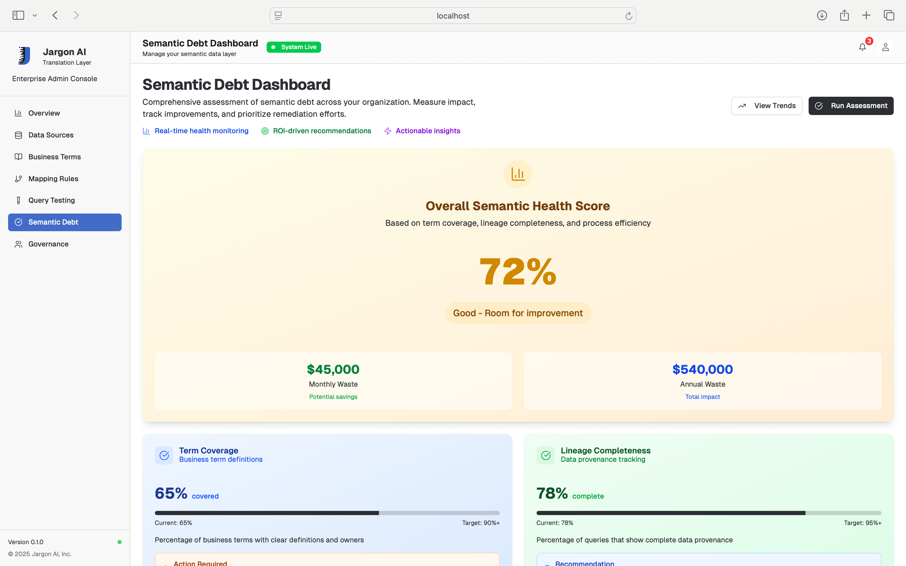

# Jargon - Enterprise Data Translation Layer

[](https://github.com/Mat-Tom-Son/jargon)
[](https://www.typescriptlang.org/)
[](LICENSE)

> **Enterprise-grade semantic data translation.** Unify your business systems into a single, intelligent API layer.

Jargon transforms complex enterprise data sources (Salesforce, PostgreSQL, REST APIs) into a unified, semantic-aware interface. Build once, integrate everywhere - from chatbots to analytics platforms.

## The Problem

Your business data lives everywhere:
- Customer data in Salesforce with nested objects and weird field names
- Financial data in PostgreSQL with different column formats  
- Product data from REST APIs with inconsistent response structures
- Each system calls the same concept different things ("customer" vs "account" vs "contact")

Every AI tool or chatbot needs custom integration code, authentication handling, and data normalization. Teams waste time building the same connectors over and over.

## The Solution

**One API to rule them all.** Jargon provides:

- **Unified Data Access**: Query Salesforce, PostgreSQL, and REST APIs through a single endpoint
- **Consistent Output**: All responses use the same JSON schema regardless of source
- **Semantic Definitions**: Define what "active_customer" means once, use it everywhere
- **AI-Ready**: Clean, normalized data perfect for LLM context and chatbot integration
- **Semantic Debt Tracking**: Monitor and reduce the hidden costs of unclear terminology

## Quick Start

```bash
git clone https://github.com/Mat-Tom-Son/jargon.git
cd jargon

# Install all dependencies
pnpm install

# Setup the main gateway server
cd apps/gateway
npm run setup  # Creates .env file
# Edit .env with your database credentials

# Start the unified API server
npm run dev

# In another terminal, start the admin interface
cd ../../frontend
npm run dev
```

Visit `http://localhost:3000` for the admin interface and `http://localhost:3001` for API access.

### One-Command Sanity Check

```bash
# With gateway running on :3001
cd apps/gateway && npm run test
# Verifies: /whoami, /health, /sources CRUD, sample REST and SQL execution
```

## 🎛️ **Admin Interface Features**

The admin interface provides:

- **Overview Dashboard** - System health and recent activity
- **Data Sources** - Configure and manage your data connections
- **Business Terms** - Define semantic concepts and terminology
- **Mapping Rules** - Connect terms to data source queries
- **Query Testing** - Test your semantic queries in real-time
- **Semantic Debt** - Monitor terminology clarity and efficiency
- **Governance** - Approval workflows and compliance tracking
- **Settings** - Configure environment variables and integrations

## ⚙️ **Easy Setup for New Developers**

1. **Start the servers:**
   ```bash
   cd apps/gateway && npm run dev
   cd ../../frontend && npm run dev
   ```

2. **Configure your integrations:**
   - Visit `http://localhost:3000/settings`
   - Set up PostgreSQL, Salesforce, or REST API credentials
   - All changes apply immediately

3. **Test your setup:**
   ```bash
   cd apps/gateway
   npm run test
   ```

4. **Confirm you’re on the right server:**
   ```bash
   curl http://localhost:3001/whoami
   # → { "server": "file-backed-gateway", ... }
   ```

### Test Your Setup

```bash
# Run integration tests
cd apps/gateway
npm run test

# Restart server after configuration changes
npm run restart
# or from project root:
npm run restart
```

### Configuration Management

After updating settings in the admin UI (`http://localhost:3000/settings`):

1. **Configuration is automatically saved** to `apps/gateway/.env`
2. **Restart the server** to apply changes:
   ```bash
   npm run restart
   ```
3. **Verify changes** in the admin interface

## How It Works

### 1. Connect Your Data Sources

```javascript
// Configure once
const sources = {
  salesforce: {
    instanceUrl: "https://yourorg.salesforce.com",
    accessToken: "your-token"
  },
  database: {
    connectionString: "postgresql://..."
  },
  api: {
    baseUrl: "https://api.yourcompany.com",
    headers: { "Authorization": "Bearer token" }
  }
}
```

### 2. Define Business Terms

```json
{
  "active_customer": {
    "definition": "Customer with activity in last 90 days",
    "sources": {
      "salesforce": "SELECT Id, Name FROM Account WHERE LastActivityDate > :90_days_ago",
      "database": "SELECT customer_id, name FROM customers WHERE last_login > NOW() - INTERVAL '90 days'"
    }
  }
}
```

### 3. Query Everything Uniformly

```javascript
// Same API call regardless of data source
const response = await fetch('/api/execute', {
  method: 'POST',
  body: JSON.stringify({
    term: "active_customer",
    filters: { region: "North America" }
  })
});

// Always get the same response format
const data = await response.json();
console.log(data.results); // Consistent structure every time
```

### 4. Perfect for AI Integration

```javascript
// Your chatbot gets clean, consistent data
const context = await jargon.query("active_customers_by_region");
const prompt = `Based on this data: ${JSON.stringify(context)}, answer the user's question about customers.`;
```

## Architecture

```
┌─────────────────┐    ┌─────────────────┐    ┌─────────────────┐
│   Your Apps     │────│     Jargon      │────│  Data Sources   │
│                 │    │                 │    │                 │
│ • Chatbots      │    │ • Query Parser  │    │ • Salesforce    │
│ • Dashboards    │    │ • Data Mapper   │    │ • PostgreSQL    │
│ • Analytics     │    │ • Result Cache  │    │ • REST APIs     │
│ • Custom Tools  │    │ • Access Control│    │ • More...       │
└─────────────────┘    └─────────────────┘    └─────────────────┘
```

## Key Features

### Dashboard Overview
Real-time monitoring and system health at a glance



- **System Status**: Live health metrics and uptime monitoring
- **Recent Activity**: Latest mappings, approvals, and system events
- **Quick Actions**: One-click access to critical workflows

### Data Source Management
Unified interface for heterogeneous data source configuration



- **Salesforce Integration**: Native Salesforce API connectivity
- **PostgreSQL Support**: Advanced SQL database connections
- **REST API Connectors**: Generic REST endpoint support
- **Extensible Framework**: Custom connector development

### Business Terms Management
Define and manage semantic contracts across your organization



- **Semantic Definitions**: Clear business term documentation
- **Search & Discovery**: Full-text search across all terminology
- **Categorization**: Organize terms by domain and business unit
- **Cross-References**: Link related concepts and terms

### Mapping Rules Engine
Visual rule builder for translating business terms to data queries



- **Drag-and-Drop Interface**: Intuitive rule creation workflow
- **Field Discovery**: Automatic field detection and type inference
- **Validation Engine**: Real-time rule validation and conflict detection
- **Version Control**: Track mapping rule changes over time

### Query Testing Interface
Live translation and testing of semantic queries



- **Real-Time Translation**: See business terms converted to SQL instantly
- **Lineage Visualization**: Complete query execution traceability
- **Result Preview**: Sample data with field-level provenance
- **Export Capabilities**: Save and share tested queries

### Governance Dashboard
Enterprise-grade approval workflows and compliance tracking



- **Term Lifecycle**: Draft → Review → Approval state management
- **Multi-Step Workflows**: Role-based governance and approvals
- **Compliance Metrics**: Review completion and stewardship tracking
- **Audit Trails**: Complete history of all term changes

### Semantic Debt Assessment
Quantify and reduce the hidden costs of unclear terminology



- **Overall Health Score**: 72% with detailed component breakdowns
- **ROI Calculator**: $45K monthly waste identification and savings projections
- **Priority Recommendations**: AI-powered improvement suggestions
- **Progress Tracking**: Visual metrics with historical trend analysis

## Current Features

- **Data Connectors**: Salesforce, PostgreSQL, REST APIs
- **Query Translation**: Business terms to actual queries
- **Response Normalization**: Consistent JSON output format
- **Semantic Debt Tracking**: Monitor terminology clarity costs
- **Admin UI**: Manage terms, sources, and test queries
- **Policy Engine**: Open Policy Agent (OPA) access control
- **Production Ready**: Real database connections and enterprise features

## Project Structure

```
jargon/
├── frontend/                   # Next.js admin interface
│   ├── app/                    # Next.js app router pages
│   ├── components/             # Reusable UI components
│   └── public/                 # Static assets
├── apps/
│   └── gateway/                # Main unified API gateway
├── packages/                   # Core business logic
│   ├── core/                   # Query translation engine
│   ├── connectors/             # Data source adapters
│   ├── semantic-debt/          # Debt assessment & tracking
│   ├── policy/                 # OPA policy enforcement
│   ├── registry/               # Business term storage
│   ├── lineage/                # Data lineage tracking
│   ├── context/                # LLM context generation
│   ├── codegen/                # OpenAPI spec generation
│   └── cli/                    # Command-line tools
├── config/                     # Configuration files
├── opa/                        # Open Policy Agent policies
├── infra/                      # Infrastructure (Docker, etc.)
└── docs/screenshots/           # UI screenshots and docs
```

## API Reference

### Core Endpoints

#### Execute Query
```http
POST /execute
Content-Type: application/json

{
  "term": "active_customer",
  "filters": {
    "region": "North America",
    "created_after": "2024-01-01"
  }
}
```

#### List Data Sources
```http
GET /sources
```

#### List Business Terms
```http
GET /terms
```

#### List Mapping Rules
```http
GET /rules
```

### Semantic Debt Endpoints

#### Get Debt Metrics
```http
GET /semantic-debt/metrics
```

#### Full Assessment Dashboard
```http
GET /semantic-debt/dashboard
```

#### Run Debt Assessment
```http
POST /semantic-debt/assess
Content-Type: application/json

{
  "termCoverage": 65,
  "lineageCompleteness": 78,
  "wranglingMinutes": 45
}
```

### Utility Endpoints

#### Health Check
```http
GET /health
```

#### OpenAPI Specification
```http
GET /openapi.json
```

#### LLM Context Bundle
```http
GET /context
```

## Roadmap

**Phase 1 (Current)**: Core translation layer with basic connectors
**Phase 2**: Advanced data source support (Snowflake, BigQuery, etc.)
**Phase 3**: Governance workflows and approval processes
**Phase 4**: Natural language query parsing

## Contributing

This is designed to be extended. Need a new connector? Want to improve the query parser? Contributions welcome:

1. Fork the repo
2. Add your feature
3. Test with the mock server
4. Submit a pull request

Common contribution areas:
- New data source connectors (Snowflake, BigQuery, etc.)
- Query optimization and performance improvements
- Response format enhancements
- Admin UI improvements
- Semantic debt calculation refinements

## License

Business Source License 1.1 - free for development and small businesses, commercial licensing for larger organizations. Automatically converts to Apache-2.0 in 2028.

## Why Build This?

Every company faces the same integration headaches. Instead of each team building their own Salesforce connector, their own data normalization logic, and their own business term mappings, we can share the work.

The vision: **One semantic layer, many applications.** Your chatbots, dashboards, and analytics tools all speak the same language about your business data.

---

**Ready to consolidate your APIs?** Start with `git clone` and be querying multiple systems in minutes.
